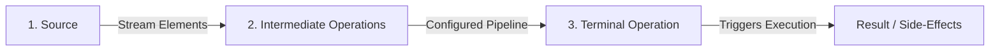

# Java 8 Streams API: Core Concepts, Architecture, & Advanced Mechanics

The Stream API is one of the most significant features introduced in Java 8. It provides a declarative, functional programming approach to processing sequences of elements (e.g., collections, arrays, I/O resources) with support for parallel execution.

---

## 1. The Stream Lifecycle
A Java Stream is not a data structure; it does not store elements. Instead, it conveys elements from a source through a pipeline of computational steps. The lifecycle of a stream consists of three distinct phases:



### Phase A: Source
A stream is initiated from a data source. Common sources include:
- **Collections**: `list.stream()`, `set.stream()`
- **Arrays**: `Arrays.stream(array)`
- **Static Factories**: `Stream.of(val1, val2)`, `Stream.iterate()`, `Stream.generate()`
- **File I/O**: `Files.lines(Paths.get(path))`
- **Primitive Streams**: `IntStream.range(1, 10)`, `LongStream`, `DoubleStream`

### Phase B: Intermediate Operations
Intermediate operations transform a stream into another stream. They are **lazy**; they do not perform any processing until a terminal operation is invoked.
- **Stateless Operations**: Elements are processed independently without retaining state from previously seen elements.
  - Examples: `filter()`, `map()`, `flatMap()`, `peek()`
- **Stateful Operations**: Must look at the entire dataset or maintain state across multiple elements before producing results.
  - Examples: `distinct()`, `sorted()`, `limit()`, `skip()`

### Phase C: Terminal Operation
A terminal operation triggers the execution of the entire pipeline, consumes the stream elements, and produces a result (e.g., a collection, a primitive value, an optional) or performs a side-effect (e.g., `forEach`). Once a terminal operation completes, the stream is **closed** and cannot be reused.
- Examples: `collect()`, `forEach()`, `reduce()`, `count()`, `findFirst()`, `anyMatch()`, `allMatch()`, `noneMatch()`, `min()`, `max()`.

---

## 2. Stream Pipelines & Lazy Evaluation

### Lazy Evaluation (Deferred Execution)
Intermediate operations are not executed when they are defined. Instead, they build a query plan or execution pipeline (internally represented as linked pipeline stages subclassing `AbstractPipeline`). 

Consider this code:
```java
List<String> names = Arrays.asList("Alice", "Bob", "Charlie", "David");
Stream<String> stream = names.stream()
    .filter(name -> {
        System.out.println("Filter: " + name);
        return name.length() > 3;
    })
    .map(name -> {
        System.out.println("Map: " + name);
        return name.toUpperCase();
    });

System.out.println("Pipeline constructed. Triggering terminal operation...");
List<String> result = stream.collect(Collectors.toList());
```

**Output:**
```
Pipeline constructed. Triggering terminal operation...
Filter: Alice
Map: Alice
Filter: Bob
Filter: Charlie
Map: Charlie
Filter: David
Map: David
```

### Order of Execution & Vertical Integration
Unlike SQL or traditional collection transformations that process an entire collection stage-by-stage (horizontal evaluation), Java Streams process elements **vertically** (one element at a time through the entire pipeline), unless stateful operations prevent it.
In the output above:
1. `"Alice"` goes through `filter` (passes) -> goes through `map`.
2. `"Bob"` goes through `filter` (fails) -> execution for `"Bob"` stops immediately. It does not go to `map`.

This vertical execution allows for **short-circuiting** optimizations. For instance, if you append `.findFirst()` or `.limit(1)` to the stream above, processing will stop as soon as the first matching element (`"Alice"`) completes the pipeline, completely ignoring the remaining elements (`"Charlie"`, `"David"`).

---

## 3. Map vs. FlatMap

| Feature | `map()` | `flatMap()` |
| :--- | :--- | :--- |
| **Operation Type** | One-to-One transformation. | One-to-Many transformation. |
| **Function Signature** | `Function<? super T, ? extends R>` | `Function<? super T, ? extends Stream<? extends R>>` |
| **Output** | Returns a stream of transformed values (`Stream<R>`). | Flattens multiple streams into a single stream (`Stream<R>`). |
| **Use Case** | Extracting a property, converting types (e.g., `Employee -> String`). | Flattening nested collections (e.g., `Employee -> List<Project> -> Stream<Project>`). |

### Visualizing Map vs. FlatMap

```
Map:
[ [1, 2], [3, 4] ]  ===>  map(x -> x)  ===>  [ [1, 2], [3, 4] ] (Nested Stream<List<Integer>>)

FlatMap:
[ [1, 2], [3, 4] ]  ===>  flatMap(List::stream)  ===>  [ 1, 2, 3, 4 ] (Flattened Stream<Integer>)
```

---

## 4. Advanced 5+ YOE Interview Questions & Answers

### Q1: What is the difference in memory and CPU footprint between stateless (e.g., `filter`, `map`) and stateful (e.g., `sorted`, `distinct`) operations?
**Answer:**
* **Stateless Operations (`filter`, `map`)**: Have an $O(1)$ memory overhead per element because they process elements one by one without needing to know what came before or what comes next. They are highly performant and extremely friendly to parallelization.
* **Stateful Operations (`sorted`, `distinct`, `limit`, `skip`)**: Have up to $O(N)$ memory and time overhead. 
  - For `sorted()`, the stream execution must block, buffering all elements from the upstream into an internal array structure to perform the sort before emitting any elements downstream. This can cause high memory consumption and latency spike.
  - For `distinct()`, the stream must maintain an internal `HashSet` of seen elements to check duplicates. If the stream is infinite or extremely large, this will lead to an `OutOfMemoryError` or high memory pressure.

### Q2: What happens if you attempt to reuse a stream? How does the JVM enforce this?
**Answer:**
A stream is a one-use-only object. If you attempt to invoke an intermediate or terminal operation on a stream that has already started execution or has completed its terminal operation, the JVM throws an `IllegalStateException` with the message `"stream has already been operated upon or closed"`.
This is enforced internally by a boolean state flag `linkedOrConsumed` inside the `AbstractPipeline` abstract class. When any pipeline stage or terminal action is initiated, this flag is set to `true`. Any subsequent method call on the same stream reference checks this flag and throws `IllegalStateException` if it is already `true`.

### Q3: Explain how intermediate and terminal operations are chained under the hood. How does Java compile the pipeline?
**Answer:**
Under the hood, intermediate operations construct a linked list of pipeline stages. Each stage is represented by an implementation of the `PipelineHelper` and `Sink` interface.
- A `Sink` is a consumer that receives elements from upstream, processes them, and pushes them downstream using three primary methods:
  - `begin(long size)`: Signals that elements are coming, allowing stateful operations to allocate memory.
  - `accept(T value)`: Processes an individual element.
  - `end()`: Signals that all elements have been processed, triggering stateful operations (like sorting or reduction) to output their buffered data.
- When a terminal operation is called, the stream framework travels upstream to compile a single chained execution loop of `Sink` instances. This chain is executed as a single pass over the elements, avoiding overhead and enabling JIT compilation to optimize the entire traversal.

### Q4: Does `flatMap` have any memory impact or performance concerns compared to iterative nested loops?
**Answer:**
Yes. `flatMap` requires returning a `Stream<R>` for each element of the outer stream. This means that if you have a stream of 100,000 employees and you flatmap their projects, the JVM will instantiate 100,000 temporary `Stream` objects. 
This object allocation causes garbage collection (GC) pressure. For high-performance, low-latency code, nesting traditional loops or using custom collectors might be faster than `flatMap` due to the overhead of short-lived `Stream` allocations.

### Q5: How do short-circuiting operations (e.g., `anyMatch`, `findFirst`, `limit`) behave in parallel streams?
**Answer:**
In a sequential stream, short-circuiting is straightforward: as soon as a condition is satisfied, the loop terminates. 
In a parallel stream (which utilizes the ForkJoinPool), short-circuiting is much more complex:
- If one thread finds a match in `anyMatch`, it sets a shared cancelation flag to notify other threads to stop their work early. However, due to thread scheduling, other threads may continue computing for some time before checking the flag.
- For order-sensitive operations like `findFirst()` or `limit()`, the parallel stream must respect the encounter order of the source. Even if a thread processing a partition later in the stream finishes first, the framework must wait or buffer results to ensure the actual first element in the original sequence is returned. Thus, using `findFirst` in parallel streams can hurt performance significantly compared to `findAny()`, which has no order constraint.
